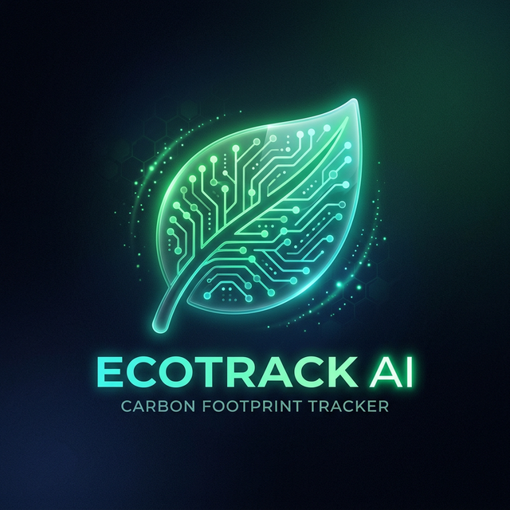

<p align="center">
  
</p>

<h1 align="center">EcoTrack AI</h1>

<p align="center">
  <strong>AI-Powered Carbon Footprint Intelligence Platform</strong>
</p>

<p align="center">
  <a href="#features">Features</a> •
  <a href="#tech-stack">Tech Stack</a> •
  <a href="#installation">Installation</a> •
  <a href="#ecoscore-system">EcoScore</a> •
  <a href="#contributing">Contributing</a>
</p>

<p align="center">
  
  
  
  
  
</p>

---

## 📖 Overview

**EcoTrack AI** is an advanced intelligent platform designed to help individuals and organizations calculate, predict, and reduce their carbon emissions. By utilizing state-of-the-art machine learning algorithms and real-time data tracking, EcoTrack AI provides personalized insights, dynamic EcoScores, and actionable recommendations to inspire a more sustainable future.

Track your impact, save the planet, and join thousands of EcoWarriors!

---

## Key Features

- **Smart Calculator**: Precisely measure emissions across Transport, Energy Use, Food, and Shopping with localized emission factors.
- **AI Predictions**: Leverage Machine Learning to forecast your future carbon footprint and identify major emission sources.
- **Dynamic EcoScore System**: A real-time 0-800 scale rating that evaluates your environmental impact.
- **Interactive Analytics Dashboard**: Visualize trends, compare your progress with community averages, and track reductions.
- **Carbon Offset Calculator**: Calculate exact figures for how many trees are needed to offset your remaining emissions.
- **Campus Leaderboard**: Compete with friends, colleagues, or campuses to drive corporate sustainability and NGO integration.
- **PWA Ready**: Installable as a Progressive Web App for native mobile access.

---

## Tech Stack

### **Frontend**
* **HTML5 / CSS3**: Modern styling, responsive layout, glassmorphism UI, and dynamic animations.
* **Vanilla JavaScript**: Core logic, API integrations, and interactive UI components.
* **PWA**: `manifest.json` and service workers for offline and app-like experience.

### **Backend**
* **Python**: Core backend language.
* **Flask**: Lightweight WSGI web application framework.
* **Scikit-Learn**: Machine learning for carbon prediction models.
* **Groq API**: Advanced AI recommendations and natural language processing.
* **PyMongo & MongoDB**: NoSQL database for secure data persistence.

### **Security & Auth**
* **JWT (JSON Web Tokens)**: Secure stateless authentication.
* **Bcrypt**: Robust password hashing.
* **Twilio/EmailJS**: OTP verification for onboarding.

---

## 🚀 Getting Started

Follow these instructions to get a copy of the project up and running on your local machine for development and testing purposes.

### 1. Prerequisites
- Python 3.9+
- MongoDB instance (local or Atlas)
- Node.js (Optional, if implementing UI bundling in future)

### 2. Clone the Repository
```bash
git clone https://github.com/Bhavishaya789/EcoTrack_AI.git
cd EcoTrack_AI
```

### 3. Setup Virtual Environment
```bash
python -m venv .venv
# On Windows
.venv\Scripts\activate
# On Linux/Mac
source .venv/bin/activate
```

### 4. Install Dependencies
```bash
pip install -r requirements.txt
```

### 5. Environment Variables
Create a `.env` file in the root directory and add the following keys:
```env
MONGO_URI=mongodb+srv://<username>:<password>@cluster.mongodb.net/ecotrack
JWT_SECRET=your_super_secret_jwt_key
GROQ_API_KEY=your_groq_api_key
# Add other keys like Twilio credentials if necessary
```

### 6. Run the Application
```bash
# Run using the provided batch script (Windows)
Launch_EcoTrack_AI.bat

# Or run manually
cd backend_py
python app.py
```
*Visit `http://localhost:5000` or open `index.html` via Live Server.*

---

## 📈 The EcoScore System

EcoTrack AI uses a sophisticated scoring system (0-800) to gauge your lifestyle.

| Score Range | Tier | Status | Description |
| :---: | :--- | :--- | :--- |
| **0 - 100** | 🔴 Red | High Pollution | Urgent action needed. Footprint is critically high. |
| **100 - 300** | 🟠 Orange | Moderate | Room for significant improvement. |
| **300 - 600** | 🟡 Yellow | Good | You're on the right track! |
| **600 - 800** | 🟢 Green | Eco Friendly | Excellent! You are a true environmental champion. |

---

## 📂 Project Structure

```text
EcoTrack_AI/
│
├── frontend/
│   ├── index.html               # Landing page and entry point
│   ├── dashboard.html           # Main user dashboard
│   ├── calculator.html          # Emission tracking input forms
│   ├── offset.html              # Offset calculator
│   ├── css/                     # Styling rules and palettes
│   ├── js/                      # Frontend application logic
│   └── assets/                  # Images and icons
│
├── backend_py/
│   ├── app.py                   # Main Flask API
│   ├── models.py                # Database schemas & ML loading
│   └── routes/                  # API endpoint definitions
│
├── requirements.txt             # Python dependencies
├── manifest.json                # PWA Configuration
└── README.md                    # Project documentation
```

---

## 🤝 Contributing

Contributions are what make the open source community such an amazing place to learn, inspire, and create. Any contributions you make are **greatly appreciated**.

1. Fork the Project
2. Create your Feature Branch (`git checkout -b feature/AmazingFeature`)
3. Commit your Changes (`git commit -m 'Add some AmazingFeature'`)
4. Push to the Branch (`git push origin feature/AmazingFeature`)
5. Open a Pull Request

---

## 📄 License

Distributed under the MIT License. See `LICENSE` for more information.

---

## 📞 Contact

**Project Maintainer**: [Bhavishaya789](https://github.com/Bhavishaya789)  
**Project Link**: [https://github.com/Bhavishaya789/EcoTrack_AI](https://github.com/Bhavishaya789/EcoTrack_AI)

<p align="center">
  <i>Built with Passion for a greener tomorrow.</i><br>
  <i>Carbon Formula: Emission = Activity × Emission Factor</i>
</p>
